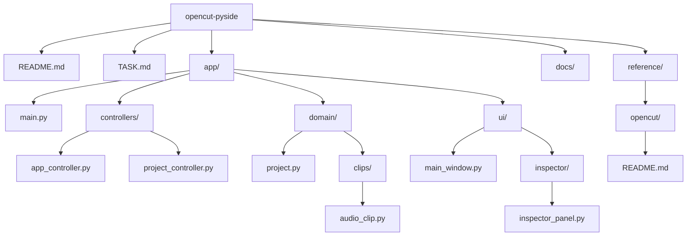

# Sơ đồ cấu trúc dự án

Mô tả: Sơ đồ cấu trúc file của dự án `opencut-pyside` (dựa trên trạng thái workspace hiện tại).

## Cây thư mục (text)

```text
opencut-pyside/
├─ README.md
├─ TASK.md
├─ app/
│  ├─ __init__.py
│  ├─ bootstrap.py
│  ├─ main.py
│  ├─ bin/
│  ├─ controllers/
│  │  ├─ __init__.py
│  │  ├─ app_controller.py
│  │  ├─ export_controller.py
│  │  ├─ inspector_controller.py
│  │  ├─ playback_controller.py
│  │  ├─ project_controller.py
│  │  ├─ selection_controller.py
│  │  └─ timeline_controller.py
│  ├─ domain/
│  │  ├─ __init__.py
│  │  ├─ keyframe.py
│  │  ├─ markers.py
│  │  ├─ project.py
│  │  ├─ selection.py
│  │  ├─ timeline.py
│  │  ├─ track.py
│  │  └─ clips/
│  │     ├─ __init__.py
│  │     ├─ audio_clip.py
│  │     ├─ base_clip.py
│  │     ├─ image_clip.py
│  │     ├─ text_clip.py
│  │     └─ video_clip.py
│  ├─ commands/
│  │  ├─ __init__.py
│  │  ├─ base_command.py
│  │  ├─ delete_clip.py
│  │  ├─ move_clip.py
│  │  ├─ split_clip.py
│  │  ├─ trim_clip.py
│  │  └─ update_property.py
│  ├─ dto/
│  │  ├─ __init__.py
│  │  ├─ export_dto.py
│  │  ├─ media_dto.py
│  │  └─ project_dto.py
│  ├─ infrastructure/
│  │  ├─ __init__.py
│  │  ├─ cache_store.py
│  │  ├─ ffmpeg_gateway.py
│  │  ├─ ffprobe_gateway.py
│  │  ├─ file_repository.py
│  │  ├─ process_runner.py
│  │  ├─ temp_manager.py
│  │  └─ services/
│  │     ├─ __init__.py
│  │     ├─ autosave_service.py
│  │     ├─ caption_service.py
│  │     ├─ export_service.py
│  │     ├─ media_service.py
│  │     ├─ playback_service.py
│  │     ├─ project_service.py
│  │     └─ thumbnail_service.py
│  ├─ tests/
│  │  ├─ __init__.py
│  │  ├─ domain/
│  │  │  └─ __init__.py
│  │  ├─ integration/
│  │  │  └─ __init__.py
│  │  └─ services/
│  │     └─ __init__.py
│  ├─ ui/
│  │  ├─ __init__.py
│  │  ├─ app_shell.py
│  │  ├─ main_window.py
│  │  ├─ inspector/
│  │  │  ├─ __init__.py
│  │  │  ├─ image_inspector.py
│  │  │  ├─ inspector_panel.py
│  │  │  ├─ project_inspector.py
│  │  │  ├─ text_inspector.py
│  │  │  └─ video_inspector.py
│  │  ├─ media_panel/
│  │  │  ├─ __init__.py
│  │  │  ├─ media_item_widget.py
│  │  │  └─ media_panel.py
│  │  ├─ preview/
│  │  │  ├─ __init__.py
│  │  │  ├─ canvas_overlay.py
│  │  │  ├─ playback_toolbar.py
│  │  │  └─ preview_widget.py
│  │  ├─ shared/
│  │  │  ├─ __init__.py
│  │  │  ├─ dialogs.py
│  │  │  ├─ icons.py
│  │  │  └─ theme.py
│  │  └─ timeline/
│  │     ├─ __init__.py
│  │     ├─ clip_item.py
│  │     ├─ playhead_item.py
│  │     └─ ruler_widget.py
│  └─ utils/
│     ├─ __init__.py
│     ├─ id_generator.py
│     ├─ math_utils.py
│     └─ timecode.py
├─ docs/
│  ├─ architecture.md
│  ├─ dev-guide.md
│  ├─ feature-map.md
│  ├─ product-spec.md
│  ├─ project-plan.md
│  └─ prompts-for-ai.md
└─ reference/
   ├─ opencut/
   │  ├─ AGENTS.md
   │  ├─ biome.json
   │  ├─ Cargo.toml
   │  ├─ docker-compose.yml
   │  ├─ LICENSE
   │  ├─ package.json
   │  ├─ README.md
   │  ├─ tsconfig.json
   │  ├─ turbo.json
   │  ├─ wrangler.jsonc
   │  ├─ apps/
   │  ├─ docs/
   │  ├─ legacy/
   │  ├─ rust/
   │  └─ script/
```

## Diagram (Mermaid)



---

Ghi chú: Tệp này phản ánh cấu trúc hiện tại theo thông tin workspace; nếu bạn cần định dạng khác (ví dụ xuất PNG hoặc rút gọn), báo tôi.
